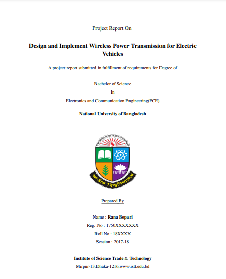
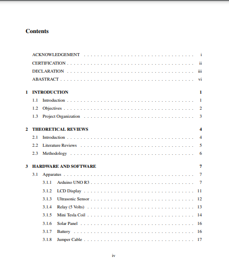
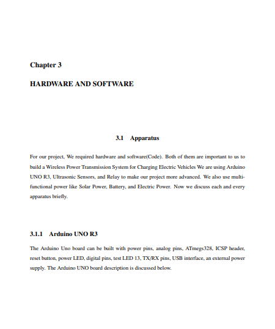
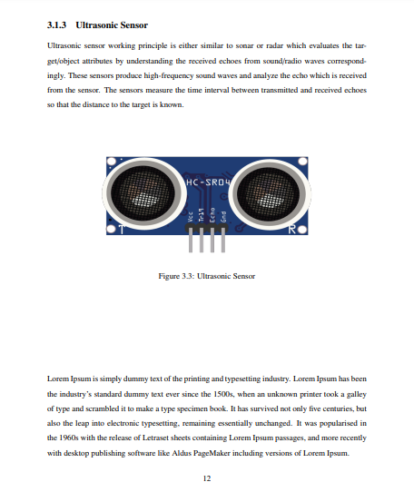
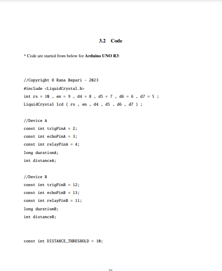
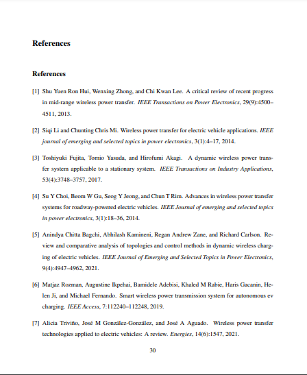

# Thesis-Template-for-Final-Year-Overleaf-or-latex
This is the thesis template for Honor's Final Year

Welcome! This is Rana Bepari here. In my B.Sc. final year, I had to submit my thesis paper and did this in Overleaf (Latex).
Then I think that is little bit difficult, but if I can make a template, It can be easier. That's why I made this template.  

<h2>Feature of Project</h2>
<ul>
  <li>You can jump from the click of the pdf table of content text</li>
  <li>Changes your info from "<i>infographyMERANAthesis/*.txt</i>" text files</li>
  <li>Modify the name from our chapter,section and subsection - Auto Page No and Chapter Added</li>
  <li>Standard font size added like 16pt,14pt & 12pt and a4size paper setup</li>
  <li>Image are automated added with generated number of image with chapterwise</li>
  <li>Added BibTex references into our "<i>references/reference.bib</i>" files, automatically visible to the paper</li>
</ul>

 <b>Modify your data as your requirements</b>
   
Thanks, 
Rana Bepari

